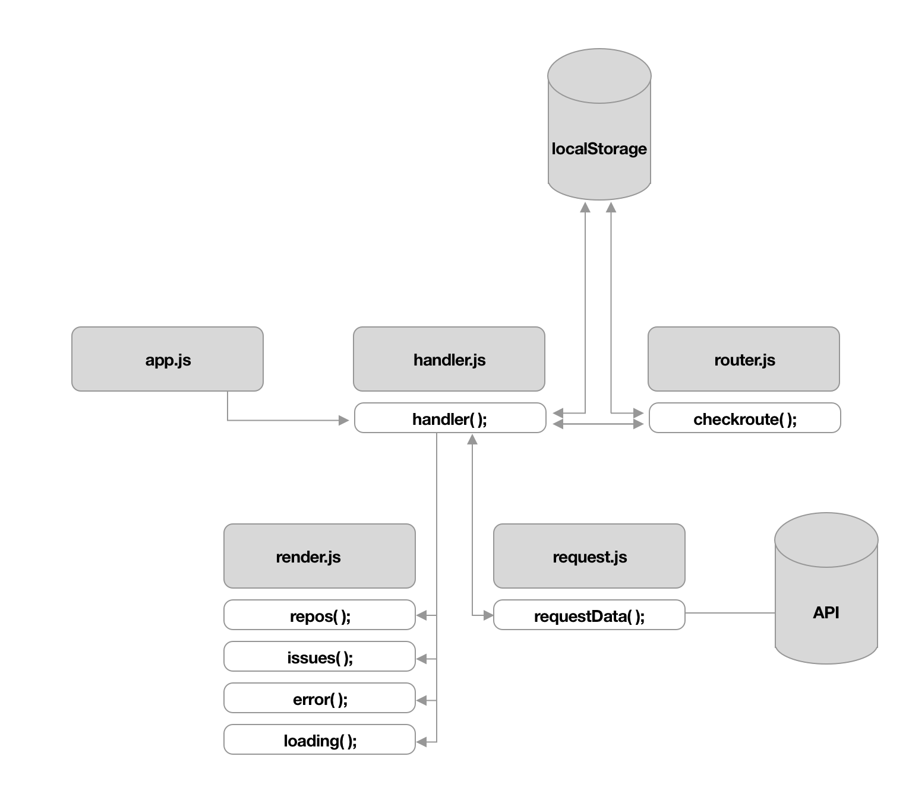

# WAFS - GitHub api repos


<!-- Add a link to your live demo in GitHub Pages 🌐-->
## Live demo
[Live demo](https://dorusth.github.io/web-app-from-scratch-18-19/week1/) | [Repo](https://github.com/dorusth/web-app-from-scratch-18-19/tree/master/week1)

<!-- ☝️ replace this description with a description of your own work -->
## GitHub repos
In this project I used the GitHub API to fetch data about the forks of the "web app from scratch" repo on GitHub and display the issues of every fork on a details page.

<!-- Add a nice image here at the end of the week, showing off your shiny frontend 📸 -->


<!-- Maybe a table of contents here? 📚 -->
## table of contents
- [Installation](#Installation)
- [Features](#Features)
- [Actor diagram](#Actor-diagram)
- [interaction diagram](#Interaction-diagram)
- [API](#API)
- [To-do/Done list](#To-do-/-Done-list)

<!-- How about a section that describes how to install this project? 🤓 -->
## Installation
this project doesn't have any dependencties so you can clone and run it with:
```bash
$ git clone https://github.com/dorusth/web-app-from-scratch-18-19.git
```
and/or download the files and open the index.html file

<!-- ...but how does one use this project? What are its features 🤔 -->
## Features
- Forks overview
- Details page with open and closed issues
- hash routing
- Error handeling
- Loading state

## Actor diagram


## Interaction diagram


<!-- What external data source is featured in your project and what are its properties 🌠 -->
## API
For this project the [GitHub API](https://developer.github.com/v3/) as data source.
By default the API only returns 30 entities with each request unles defined otherwise in the endpoint of the API.
I've used a promise to request the data from the api and use it in the app.
```javascript
function requestData(routeData){
	return new Promise((resolve, reject) =>{
		const request = new XMLHttpRequest();

		request.onload = () => {
			if (request.status >= 200 && request.status < 400) {
				const data = JSON.parse(request.responseText);
				resolve(data);
			}else{
				reject(request.status);
			}
		}
		request.open('GET', routeData, true);
		request.send();
	});
}
```

<!-- Maybe a checklist of done stuff and stuff still on your wishlist? ✅ -->
## To-do / Done list
- [x] Get data from api
- [x] Use promise to request data
- [x] Input to change user
- [x] Render data to HTML
- [x] Style rendered data
- [x] Research data to use
- [x] Add interactions
- [x] Multiple pages
- [x] Routes
- [x] Add/use open and closed issue Routes
- [x] Add states
- [x] Manipulate Data
- [x] Structure code in modules
- [x] Refactor rendering and route handeling
- [ ] Option to switch between repos


## other sources

Google developers  [js promises docs](https://developers.google.com/web/fundamentals/primers/promises)
<!-- How about a license here? 📜 (or is it a licence?) 🤷 -->

[MIT](LICENCE) © [Dorus ten Haaf](https://dorustenhaaf.com)
